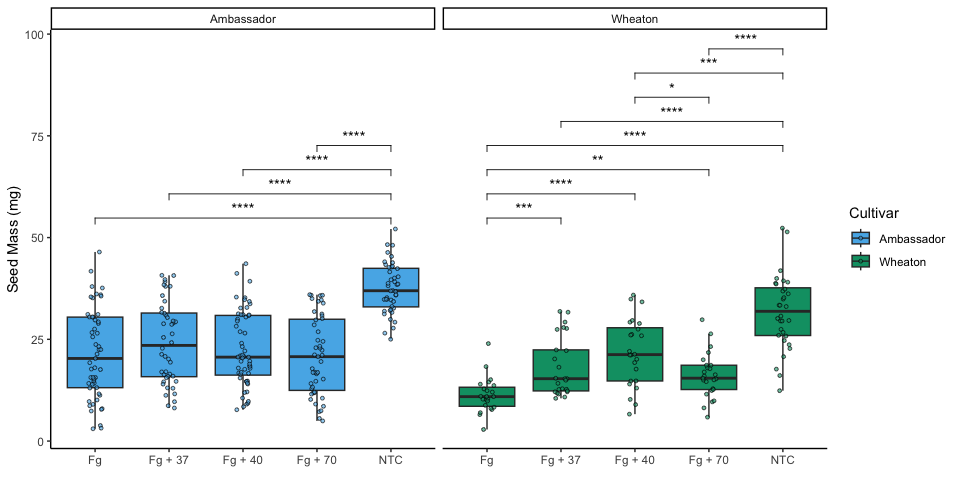

## Instructions

Markdown – 25 pts

This assignment will help you practice integrating markdown into your R
scripts for literate programming. It will also involve some more
practice with GitHub. You may collaborate with a partner to enhance your
learning experience. Please ensure the following:

- Collaboration: If you work with a partner, include both names on the
  final submission by editing the YAML header.
- Submission: Only one person should submit the assignment to Canvas in
  a Word document or .pdf file generated through R markdown.
  Additionally, you should provide a link to your GitHub, where the
  assignment should be viewable by rendering it as a GitHub-flavored
  markdown file.
- Setup: It is also assumed you already have a GitHub repository for
  this class.

## Questions

### 1. 4 pts. Explain the following

1.  YAML header

> It is a way to specify settings and metadata for the document. In a R
> Markdown document, the YAML header is delimited by `---` at the
> beginning and end of the header, before the actual content of the
> file.

2.  Literate programming

> It is a concept in programming where the code is written combined with
> a natural language (e.g. English or Portuguese) to make it more
> readable and understandable by people. This is useful for sharing code
> or documenting it.

### 2. 6 pts. Take the code you wrote for coding challenge 3, question 5, and incorporate it into your R markdown file. Some of you have already been doing this, which is great! Your final R markdown file should have the following elements.

1.  At the top of the document, make a clickable link to the manuscript
    where these data are published. The link is here:

> Noel, Z.A., Roze, L.V., Breunig, M., Trail, F. 2022. Endophytic fungi
> as promising biocontrol agent to protect wheat from Fusarium
> graminearum head blight. Plant Disease.
> <https://doi.org/10.1094/PDIS-06-21-1253-RE>

2.  Read the data using a relative file path with na.strings option set
    to “na”. This means you need to put the Mycotoxin.csv file we have
    used for the past two weeks into your directory, which git tracks.
3.  Make a separate code chunk for the figures plotting the DON data,
    15ADON, and Seedmass, and one for the three combined using
    ggarrange.

This code uses data from [Noel et
al. 2022](https://doi.org/10.1094/PDIS-06-21-1253-RE).

``` r
# Load libraries

# Load libraries
library(tidyverse)
```

    ## ── Attaching core tidyverse packages ──────────────────────── tidyverse 2.0.0 ──
    ## ✔ dplyr     1.1.4     ✔ readr     2.1.5
    ## ✔ forcats   1.0.0     ✔ stringr   1.5.1
    ## ✔ ggplot2   3.5.1     ✔ tibble    3.2.1
    ## ✔ lubridate 1.9.4     ✔ tidyr     1.3.1
    ## ✔ purrr     1.0.4     
    ## ── Conflicts ────────────────────────────────────────── tidyverse_conflicts() ──
    ## ✖ dplyr::filter() masks stats::filter()
    ## ✖ dplyr::lag()    masks stats::lag()
    ## ℹ Use the conflicted package (<http://conflicted.r-lib.org/>) to force all conflicts to become errors

``` r
library(ggpubr)

# Read in the data
## Treatment, Cultivar, MassperSeed_mg, DON, 15ADON, BioRep
data <- read_csv("../Coding Challenge 3/MycotoxinData.csv", na="na") %>% 
            mutate(BioRep = as.factor(BioRep), Treatment = as.factor(Treatment),
                   Cultivar = as.factor(Cultivar))
```

    ## Rows: 375 Columns: 6
    ## ── Column specification ────────────────────────────────────────────────────────
    ## Delimiter: ","
    ## chr (2): Treatment, Cultivar
    ## dbl (4): BioRep, MassperSeed_mg, DON, 15ADON
    ## 
    ## ℹ Use `spec()` to retrieve the full column specification for this data.
    ## ℹ Specify the column types or set `show_col_types = FALSE` to quiet this message.

``` r
# Define color palette
cbbPalette <- c("#000000", "#E69F00", "#56B4E9", "#009E73",
                "#F0E442", "#0072B2", "#D55E00", "#CC79A7")
```

``` r
# DON
DON <- ggplot(data, aes(x = Treatment, y = DON, fill = Cultivar)) +
            geom_boxplot(outliers = FALSE) +
            geom_point(position = position_jitterdodge(), shape = 21,
                       color = "black", size = 1, alpha=0.6) +
            labs(y = "DON (ppm)", x = element_blank()) +
            scale_fill_manual(values = cbbPalette[3:4], name = "Cultivar",
                              labels = c("Ambassador", "Wheaton")) +
            theme_classic() +
            facet_wrap(~ Cultivar) +
            geom_pwc(aes(group = Treatment),
                     method = "t_test", label = "p.adj.signif", hide.ns = TRUE)

DON
```

    ## Warning: Removed 8 rows containing non-finite outside the scale range
    ## (`stat_boxplot()`).

    ## Warning: Removed 8 rows containing non-finite outside the scale range
    ## (`stat_pwc()`).

    ## Warning: Removed 8 rows containing missing values or values outside the scale range
    ## (`geom_point()`).

<!-- -->

``` r
# X15ADON
X15ADON <- ggplot(data, aes(x = Treatment, y = `15ADON`, fill = Cultivar)) +
            geom_boxplot(outliers = FALSE) +
            geom_point(position = position_jitterdodge(), shape = 21,
                       color = "black", size = 1, alpha=0.6) +
            labs(y = "15ADON", x = element_blank()) +
            scale_fill_manual(values = cbbPalette[3:4], name = "Cultivar",
                              labels = c("Ambassador", "Wheaton")) +
            theme_classic() +
            facet_wrap(~ Cultivar) +
            geom_pwc(aes(group = Treatment),
                     method = "t_test", label = "p.adj.signif", hide.ns = TRUE)

X15ADON
```

    ## Warning: Removed 10 rows containing non-finite outside the scale range
    ## (`stat_boxplot()`).

    ## Warning: Removed 10 rows containing non-finite outside the scale range
    ## (`stat_pwc()`).

    ## Warning: Removed 10 rows containing missing values or values outside the scale range
    ## (`geom_point()`).

<!-- -->

``` r
# MassperSeed_mg
seedmass <- ggplot(data, aes(x = Treatment, y = MassperSeed_mg, fill = Cultivar)) +
            geom_boxplot(outliers = FALSE) +
            geom_point(position = position_jitterdodge(), shape = 21,
                       color = "black", size = 1, alpha=0.6) +
            labs(y = "Seed Mass (mg)", x = element_blank()) +
            scale_fill_manual(values = cbbPalette[3:4], name = "Cultivar",
                              labels = c("Ambassador", "Wheaton")) +
            theme_classic() +
            facet_wrap(~ Cultivar) +
            geom_pwc(aes(group = Treatment),
                     method = "t_test", label = "p.adj.signif", hide.ns = TRUE)

seedmass
```

    ## Warning: Removed 2 rows containing non-finite outside the scale range
    ## (`stat_boxplot()`).

    ## Warning: Removed 2 rows containing non-finite outside the scale range
    ## (`stat_pwc()`).

    ## Warning: Removed 2 rows containing missing values or values outside the scale range
    ## (`geom_point()`).

<!-- -->

``` r
# Combine plots
ggarrange(DON, X15ADON, seedmass,
          labels = c("A", "B", "C"), ncol=3, common.legend = TRUE, legend = "bottom")
```

    ## Warning: Removed 8 rows containing non-finite outside the scale range
    ## (`stat_boxplot()`).

    ## Warning: Removed 8 rows containing non-finite outside the scale range
    ## (`stat_pwc()`).

    ## Warning: Removed 8 rows containing missing values or values outside the scale range
    ## (`geom_point()`).

    ## Warning: Removed 8 rows containing non-finite outside the scale range
    ## (`stat_boxplot()`).

    ## Warning: Removed 8 rows containing non-finite outside the scale range
    ## (`stat_pwc()`).

    ## Warning: Removed 8 rows containing missing values or values outside the scale range
    ## (`geom_point()`).

    ## Warning: Removed 10 rows containing non-finite outside the scale range
    ## (`stat_boxplot()`).

    ## Warning: Removed 10 rows containing non-finite outside the scale range
    ## (`stat_pwc()`).

    ## Warning: Removed 10 rows containing missing values or values outside the scale range
    ## (`geom_point()`).

    ## Warning: Removed 2 rows containing non-finite outside the scale range
    ## (`stat_boxplot()`).

    ## Warning: Removed 2 rows containing non-finite outside the scale range
    ## (`stat_pwc()`).

    ## Warning: Removed 2 rows containing missing values or values outside the scale range
    ## (`geom_point()`).

<!-- -->

3.  6 pts. Knit your document together in the following formats:

<!-- -->

1.  .docx (word document) OR .pdf with a table of contents
2.  GitHub flavored markdown (.md file).

<!-- -->

4.  2 pts. Push the .docx or .pdf and .md files to GitHub inside a
    directory called Coding Challenge 4.

5.  6 pts. Now edit, commit, and push the README file for your
    repository and include the following elements.

<!-- -->

1.  A clickable link in your README to your GitHub flavored .md file
2.  A file tree of your GitHub repository.

<!-- -->

6.  1 pt. Please provide me a clickable link to your GitHub
