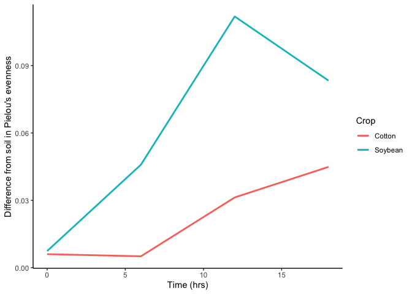

## 1. 3 pts. Download two .csv files from Canvas called DiversityData.csv and Metadata.csv, and read them into R using relative file paths.

``` r
# Load libraries
library(tidyverse)
```

    ## ── Attaching core tidyverse packages ──────────────────────── tidyverse 2.0.0 ──
    ## ✔ dplyr     1.1.4     ✔ readr     2.1.5
    ## ✔ forcats   1.0.0     ✔ stringr   1.5.1
    ## ✔ ggplot2   3.5.1     ✔ tibble    3.2.1
    ## ✔ lubridate 1.9.4     ✔ tidyr     1.3.1
    ## ✔ purrr     1.0.4     
    ## ── Conflicts ────────────────────────────────────────── tidyverse_conflicts() ──
    ## ✖ dplyr::filter() masks stats::filter()
    ## ✖ dplyr::lag()    masks stats::lag()
    ## ℹ Use the conflicted package (<http://conflicted.r-lib.org/>) to force all conflicts to become errors

``` r
# Read in the data
diversity <- read_csv("DiversityData.csv", na="na") %>% 
            mutate(Code = as.factor(Code))
```

    ## Rows: 70 Columns: 5
    ## ── Column specification ────────────────────────────────────────────────────────
    ## Delimiter: ","
    ## chr (1): Code
    ## dbl (4): shannon, invsimpson, simpson, richness
    ## 
    ## ℹ Use `spec()` to retrieve the full column specification for this data.
    ## ℹ Specify the column types or set `show_col_types = FALSE` to quiet this message.

``` r
metadata <- read_csv("Metadata.csv", na="na") %>%
            mutate(Code = as.factor(Code))
```

    ## Rows: 70 Columns: 5
    ## ── Column specification ────────────────────────────────────────────────────────
    ## Delimiter: ","
    ## chr (2): Code, Crop
    ## dbl (3): Time_Point, Replicate, Water_Imbibed
    ## 
    ## ℹ Use `spec()` to retrieve the full column specification for this data.
    ## ℹ Specify the column types or set `show_col_types = FALSE` to quiet this message.

## 2. 4 pts. Join the two dataframes together by the common column ‘Code’. Name the resulting dataframe alpha.

``` r
alpha <- left_join(diversity, metadata, by = "Code")
```

## 3. 4 pts. Calculate Pielou’s evenness index: Pielou’s evenness is an ecological parameter calculated by the Shannon diversity index (column Shannon) divided by the log of the richness column.

1.  Using mutate, create a new column to calculate Pielou’s evenness
    index.
2.  Name the resulting dataframe alpha_even.

``` r
alpha_even <- alpha %>% 
                mutate(even = shannon / log(richness))
```

## 4. 4. Pts. Using tidyverse language of functions and the pipe, use the summarise function and tell me the mean and standard error evenness grouped by crop over time.

1.  Start with the alpha_even dataframe
2.  Group the data: group the data by Crop and Time_Point.
3.  Summarize the data: Calculate the mean, count, standard deviation,
    and standard error for the even variable within each group.
4.  Name the resulting dataframe alpha_average

``` r
alpha_average <- alpha_even %>% 
                    group_by(Crop, Time_Point) %>% 
                    summarise(mean.even = mean(even),
                              sd.even = sd(even),
                              se.even = sd(even) / sqrt(n()))
```

    ## `summarise()` has grouped output by 'Crop'. You can override using the
    ## `.groups` argument.

## 5. 4. Pts. Calculate the difference between the soybean column, the soil column, and the difference between the cotton column and the soil column

1.  Start with the alpha_average dataframe
2.  Select relevant columns: select the columns Time_Point, Crop, and
    mean.even.
3.  Reshape the data: Use the pivot_wider function to transform the data
    from long to wide format, creating new columns for each Crop with
    values from mean.even.
4.  Calculate differences: Create new columns named diff.cotton.even and
    diff.soybean.even by calculating the difference between Soil and
    Cotton, and Soil and Soybean, respectively.
5.  Name the resulting dataframe alpha_average2

``` r
alpha_average2 <- alpha_average %>% 
                    select(Time_Point, Crop, mean.even) %>% 
                    pivot_wider(names_from = Crop, values_from = mean.even) %>% 
                    mutate(diff.cotton.even = abs(Cotton - Soil),
                           diff.soybean.even = abs(Soybean - Soil))
```

6.  4 pts. Connecting it to plots

<!-- -->

1.  Start with the alpha_average2 dataframe
2.  Select relevant columns: select the columns Time_Point,
    diff.cotton.even, and diff.soybean.even.
3.  Reshape the data: Use the pivot_longer function to transform the
    data from wide to long format, creating a new column named diff that
    contains the values from diff.cotton.even and diff.soybean.even.
4.  This might be challenging, so I’ll give you a break. The code is
    below.

`pivot_longer(c(diff.cotton.even, diff.soybean.even), names_to = "diff")`

4.  Create the plot: Use ggplot and geom_line() with ‘Time_Point’ on the
    x-axis, the column ‘values’ on the y-axis, and different colors for
    each ‘diff’ category. The column named ‘values’ come from the
    pivot_longer. The resulting plot should look like the one to the
    right.

``` r
alpha_average2 %>% 
    select(Time_Point, diff.cotton.even, diff.soybean.even) %>% 
    pivot_longer(c(diff.cotton.even, diff.soybean.even), names_to = "diff") %>% 
    rename(Crop = diff) %>% # Just to make the plot look nice
    mutate(Crop = str_replace(Crop, "diff.cotton.even", "Cotton")) %>% # Just to make the plot look nice
    mutate(Crop = str_replace(Crop, "diff.soybean.even", "Soybean")) %>% # Just to make the plot look nice
    ggplot(aes(x = Time_Point, y = value, color = Crop)) +
        geom_line(size = 1) +
        labs(x = "Time (hrs)", y = "Difference from soil in Pielou's evenness") +
        theme_classic() 
```

    ## Warning: Using `size` aesthetic for lines was deprecated in ggplot2 3.4.0.
    ## ℹ Please use `linewidth` instead.
    ## This warning is displayed once every 8 hours.
    ## Call `lifecycle::last_lifecycle_warnings()` to see where this warning was
    ## generated.

<!-- -->

## 7. 2 pts. Commit and push a gfm .md file to GitHub inside a directory called Coding Challenge 5. Provide me a link to your github written as a clickable link in your .pdf or .docx

Link : [Coding Challenge
5](https://github.com/bielasilva/PLPA-5820-SP2025/blob/main/Coding%20Challenge%205/)
